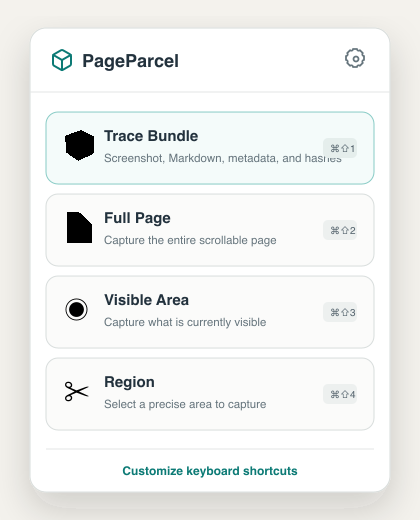

# PageParcel

<p align="center">
  
</p>

**Pack a web page into a portable, inspectable record.**

PageParcel is a local-first Chrome extension that captures the visual page and its useful structure together. One click creates a Trace Bundle with lossless screenshots, structured Markdown, reader Markdown, source metadata, and SHA-256 integrity hashes. Nothing is uploaded by the extension.

It also handles the everyday screenshot work: full-page, visible-area, and region capture; annotation; clipboard copy; and PNG, JPEG, WebP, or PDF export.

<p align="center">
  
</p>

## Why PageParcel

A screenshot preserves appearance but loses structure. A page export preserves structure but often misses what was actually rendered. PageParcel keeps both in one portable bundle:

- **Visual record:** full-page PNG segments, bounded to avoid browser canvas limits.
- **Useful text:** structured and reader-focused Markdown generated locally.
- **Source context:** URL, title, capture time, dimensions, method, and extraction status.
- **Integrity register:** byte counts and SHA-256 hashes for every bundled artifact.
- **Small permission surface:** active-tab access only, with no broad host permissions.

## What a Trace Bundle contains

```text
PageParcel-20260721T194500Z-example-page.zip
├── page.md
├── page-reader.md
├── page.json
└── page.png
```

Very tall pages are split into `page-001.png` through `page-NNN.png`. Raw HTML is deliberately excluded. The [bundle schema](references/artifact-schema.md) documents every field.

Explore the [public example Trace Bundle](docs/examples/PageParcel-Sample.zip), generated from a harmless static demonstration page and verified with the same command-line verifier used for real bundles.

## Install from source

PageParcel is currently distributed as an unpacked extension.

1. Clone this repository.
2. Open `chrome://extensions` in Chrome.
3. Enable **Developer mode**.
4. Select **Load unpacked**.
5. Choose the repository's `assets/extension-dist` folder.
6. Pin **PageParcel**.

Click **Trace Bundle** to create a local `PageParcel-*.zip`, or choose one of the standard screenshot modes.

## Verify a bundle

```bash
python3 scripts/verify_bundle.py /path/to/PageParcel-example.zip
```

The verifier checks the ZIP structure, safe paths, required artifacts, PNG signatures, byte counts, and every registered SHA-256 hash.

## Build and test

Node.js 22 and Python 3 are recommended.

```bash
bash scripts/build_extension.sh
```

The build performs a clean dependency install, runs the unit suite, produces the extension, applies the security audit, and refreshes `assets/extension-dist`.

To run the gates individually:

```bash
cd assets/extension
npm ci
npm test
npm run build
cd ../..
python3 scripts/security_audit.py assets/extension
python3 scripts/verify_bundle.py --self-test
```

## Security model

PageParcel is explicitly invoked and local-first by design. It has no analytics, upload endpoint, hosted viewer, sync storage, remote capture service, or host permissions. The extension content security policy limits connections to itself.

Secret-like form values are redacted from generated Markdown. They cannot be reliably removed from screenshot pixels, so review the page before capturing. Read the [security contract](references/security-contract.md) and [security policy](SECURITY.md) before changing permissions, networking, or extraction behavior.

The [privacy notice](PRIVACY.md) explains exactly what PageParcel processes, where temporary state is stored, and what the extension does not collect or transmit.

## Releases

GitHub Releases contain a versioned unpacked-extension ZIP and a SHA-256 checksum. The release workflow rebuilds, tests, audits, and packages the extension from the tagged source before publishing those files.

## Limits and honest claims

- Dynamic pages can change while a full-page capture scrolls.
- Cross-origin iframe content may be visible in screenshots but unavailable to Markdown extraction.
- Canvas-rendered text is visual only.
- A bundle's hashes detect later file changes; they are not an independent timestamp, signature, or proof of origin.
- Chrome-protected pages such as `chrome://` URLs cannot be captured.

## Codex integration

The repository is also a self-contained Codex skill. Install it with:

```bash
mkdir -p "$HOME/.codex/skills"
ln -s "$(pwd)" "$HOME/.codex/skills/pageparcel"
```

Then ask Codex to use `$pageparcel` when a durable browser handoff is useful.

## Project provenance

PageParcel grew from a teardown of modern full-page capture workflows and a security-first extension design. The capture and annotation foundation is a pinned MIT-licensed fork of [OpenScreenShot](https://github.com/pghqdev/OpenScreenShot). Direct dependencies and the exact upstream revision are recorded in [source provenance](references/source-provenance.md); license notices are retained in the source tree.

## Creator

Created and maintained by **Andrew Greene** ([@apcar](https://github.com/apcar)).

Contributions are welcome. See [CONTRIBUTING.md](CONTRIBUTING.md) for the engineering and security gates.

## License

MIT. See [LICENSE](LICENSE) and [THIRD_PARTY_NOTICES.md](assets/extension/THIRD_PARTY_NOTICES.md).
